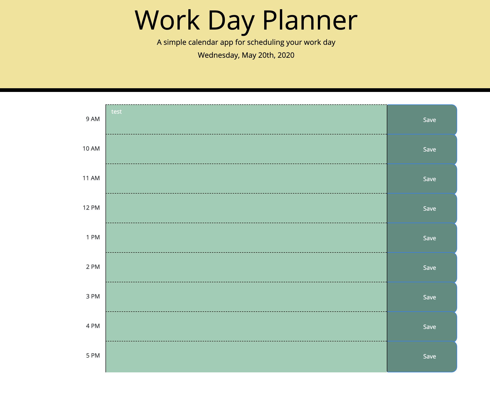

# DayPlanner

Link to the site: https://kwilks3.github.io/DayPlanner/

## What is it and what does it do?

This planner is to help organize your business day. Hours that have not yet passed will be displayed in green. Hours that have passed will be displayed in grey. If the current hour is within the business day, it will be red.

Save your tasks for the day. Feel free to leave the site and come back later. All of your tasks will be saved for you! Enjoy!

